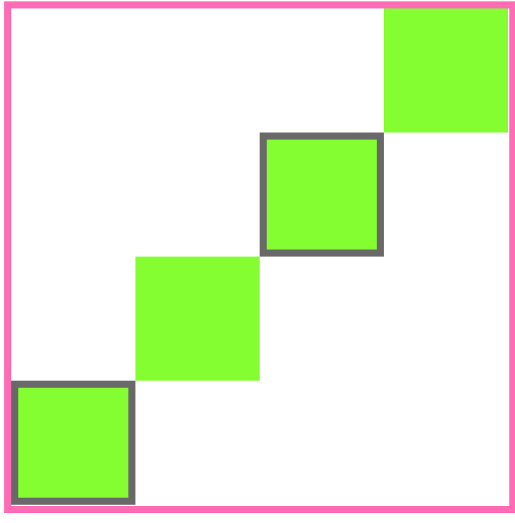

# Stairway To Heaven

Baue eine Treppe mit divs! 

Wenden Sie `width`, `height`, `background-color`, `margin` (kein `padding`!) und `box-sizing` an.

Es sollte wie das Referenzbild unten aussehen.

Erstellen Sie nun eine weitere Treppe mit denselben Eigenschaften, **außer** dass Sie diesmal `padding` und nicht `margin` verwenden.

Sie sollte wie das folgende Referenzbild aussehen.

Viel Glück und viel Spaß!

Übersetzt mit www.DeepL.com/Translator (kostenlose Version)
